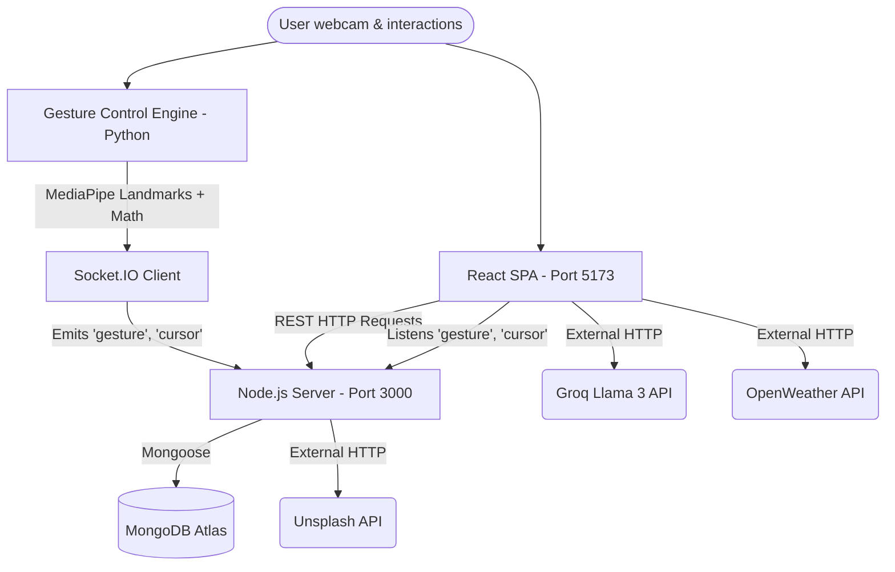

# GeoSwipe Forensic Analysis - Part 1: Architecture & Foundation

> [!NOTE]
> This is Part 1 of the exhaustive forensic analysis of the GeoSwipe project. It covers the core foundation, repository inventory, technology stack, system architecture, and deployment pipelines derived directly from the source code.

---

## 1. Executive Summary

**GeoSwipe** is a modern, highly interactive web application designed to gamify geographic and cultural heritage education. The system seamlessly integrates a **3D interactive globe** (Three.js), **real-time computer vision gesture controls** (MediaPipe/Python), **AI-driven trip planning and chatbots** (Groq/Llama 3), and **real-time multiplayer gaming** (Socket.io). 

Architecturally, GeoSwipe employs a distributed, service-oriented structure consisting of three distinct concurrently running subsystems:
1. **Frontend Client:** A Vite-powered React SPA handling complex state, 3D rendering, WebGL shaders, and API orchestrations.
2. **Backend Server:** An Express/Node.js API managing MongoDB interactions for heritage sites, quizzes, flag games, and multiplayer WebSocket synchronization.
3. **Gesture Control Engine:** An independent Python background process (`detect.py`) running OpenCV and MediaPipe to detect hand gestures via webcam and stream coordinate/classification data back to the frontend via WebSockets.

The codebase is technically ambitious, successfully bridging browser-based 3D rendering with local Python-based machine learning inference. 

---

## 2. Complete Repository Inventory

The repository is structured into three primary modules. A full inventory of the 211 files was generated (excluding dependencies and git artifacts). Below is the categorization of the core architecture:

### Root Directory
| File | Type | Purpose | Status |
|------|------|---------|--------|
| `package.json` | Config | Root workspace manager using `concurrently` to spawn all three subsystems. | [VERIFIED] Actively Used |
| `clean_file_list.txt` / `.env.example` | Config | Scripts and environment templates for deployment. | [VERIFIED] Actively Used |
| `MULTIPLAYER_ARCHITECTURE.md`, `STORYBOOK_README.md`, etc. | Docs | Extensive documentation detailing subsystems. | [VERIFIED] |

### `client/` (Frontend React SPA)
| Directory/File | Type | Purpose | Main Responsibilities |
|----------------|------|---------|-----------------------|
| `src/main.jsx` | Entry | React Mount | Initializes Context Providers (Theme, HeritageSelection). |
| `src/App.jsx` | Router | Shell | Manages React Router lazy-loading, suspense fallbacks, and global gesture cursor overlay. |
| `src/EarthThreeJS.jsx` | Core UI | 3D Engine | 2000+ line component managing the Three.js scene, textures, custom GLSL shaders, raycasting, and gesture mapping to 3D rotation. |
| `src/context/` | State | Global State | `ThemeContext.jsx` and `HeritageSelectionContext.jsx`. |
| `src/utils/` | Services | API/Logic | Orchestrates Groq AI (`groqService.js`, `tripPlannerAIService.js`), WebSockets (`multiplayerSocket.js`), weather (`openWeatherService.js`), and distance math (`safetyScoring.js`). |
| `src/assets/shaders/` | Shaders | WebGL | `vertex.glsl` and `fragment.glsl` for custom atmospheric scattering and glowing borders on the Earth mesh. |
| `src/components/` | UI | Modals/Chat | Reusable UI components like `HeritageChatbot.jsx` and `TripPlannerModal.jsx`. |

### `server/` (Backend Express API)
| Directory/File | Type | Purpose | Main Responsibilities |
|----------------|------|---------|-----------------------|
| `index.js` | Entry | Express App | Configures Mongoose, Express middleware, Socket.io for multiplayer, and defines all REST routes. |
| `models/` | Schema | Database | `HeritageSite.js`, `QuizQuestion.js`, `FlagImage.js`, `MonumentImage.js`, `Country.js`. |
| `services/` | Logic | Image Cache | `flagImageService.js` and `monumentImageService.js` handling fallback logic to Unsplash/Wikipedia APIs. |
| `mongo_data_for_heritage_sites.js` | Script | Seeder | Database seeding script for initial application setup. |

### `gesture-control/` (Python ML Engine)
| Directory/File | Type | Purpose | Main Responsibilities |
|----------------|------|---------|-----------------------|
| `detect.py` | Entry | ML Engine | Uses OpenCV and MediaPipe Hands to capture frames, calculate vectors, classify gestures (OK sign, Thumbs up, pinch), and emit Socket.io events. |
| `requirements.txt` | Config | Dependencies | Specifies `mediapipe`, `opencv-python`, `python-socketio`, `requests`. |

---

## 3. Technology Stack Analysis

### Frontend (Client)
*   **React (18.3.1):** Core UI framework. [VERIFIED] 
*   **Vite (5.4.1):** Build tool and dev server. [VERIFIED]
*   **Three.js (0.169.0):** Drives the core 3D Earth visualization. Highly critical. Uses `OrbitControls`, `Stats`, and custom GLSL materials. [VERIFIED]
*   **Socket.io-client (4.8.0):** Manages two separate connections: one to the Python Gesture Server, and one to the Node.js Multiplayer Server. [VERIFIED]
*   **Framer Motion (11.11.11):** UI micro-animations and page transitions. [VERIFIED]
*   **MapLibre GL / React Map GL:** Drives the 2D map exploration in Heritage Mode. [VERIFIED]
*   **jsPDF (2.5.2) / html2canvas:** Used in `tripPlanPdf.js` to generate downloadable itineraries. [VERIFIED]
*   **Earcut (2.2.4):** Used in `EarthThreeJS.jsx` for polygon triangulation (rendering country borders/meshes on the globe). [VERIFIED]

### Backend (Server)
*   **Node.js / Express (4.21.0):** REST API framework. [VERIFIED]
*   **MongoDB / Mongoose (8.7.0):** NoSQL database for persistence. [VERIFIED]
*   **Socket.io (4.8.0):** WebSocket server for multiplayer synchronization. [VERIFIED]
*   **Axios / Node-fetch:** For backend-to-backend API calls (Unsplash, Wikipedia). [VERIFIED]

### Machine Learning / Computer Vision (Gesture-Control)
*   **Python (3.11+):** Runtime environment. [VERIFIED]
*   **MediaPipe (0.10.14):** Google's ML pipeline for real-time hand landmark tracking. Critical dependency. [VERIFIED]
*   **OpenCV (`opencv-python`):** Captures and processes video frames. [VERIFIED]
*   **Python-SocketIO / Eventlet:** Async WebSocket client to bridge Python data to the Node/React environment. [VERIFIED]

---

## 4. Complete System Architecture

The actual architecture relies on a **Bidirectional Event-Driven Micro-Monolith**.

### 4.1 Component Boundaries

### 4.2 Architectural Patterns Identified
1. **Pub/Sub (Event-Driven):** The gesture system completely bypasses traditional HTTP. The Python script pushes high-frequency (30FPS) coordinate payloads to the Node server, which acts as a message broker and broadcasts them to the React client. The client maintains a `GlobalGestureCursor.jsx` that listens to this global event bus.
2. **Layered Service Pattern:** The frontend offloads complex logic (like Haversine distance calculations for safety scoring or AI prompt construction for trip planning) into dedicated utility services (e.g., `safetyScoring.js`, `tripPlannerAIService.js`), keeping React components mostly focused on state and rendering.
3. **State-Driven UI:** Standard React Context (`HeritageSelectionContext`) is used to lift state regarding the currently selected heritage site, preventing prop-drilling across the map, storybook, and weather panels.

---

## 5. Build & Deployment Pipeline

The project utilizes `concurrently` at the root level to unify the developer experience.

### 5.1 Local Development Flow
Running `npm start` at the repository root triggers:
`"start": "concurrently \"npm run server\" \"npm run client\" \"npm run gesture\""`

1. **Server:** `cd server && nodemon index.js` (Starts Express on `localhost:3000`).
2. **Client:** `cd client && npm run dev` (Starts Vite on `localhost:5173`).
3. **Gesture:** `cd gesture-control && geovenv\Scripts\python detect.py` (Activates virtual env and starts webcam).

### 5.2 Production Deployment Pipeline [INFERRED]
Based on `.env.example`, the deployment architecture is designed for platforms like Render or Vercel.
- **Frontend (Render/Vercel):** The client builds to static files (`vite build` outputs to `dist/`). Environment variables must be prefixed with `VITE_` (e.g., `VITE_API_URL`, `VITE_GROQ_CHATBOT_API_KEY`).
- **Backend (Render):** Deploys as a standard Node web service. Requires `ALLOWED_ORIGINS` to configure CORS strictly.
- **Python Engine:** Designed to run locally on the user's machine (as a companion app) because browsers cannot easily execute the heavy MediaPipe Python stack. The user diagram explicitly notes the Python script connects back to the deployed server URL (`SOCKET_SERVER_URL`).

> [!WARNING] 
> **Architectural Risk (Deployment):** The Python gesture control script requires the user to install Python and dependencies locally. If deployed strictly as a web app, the gesture feature is completely broken for end-users unless a browser-side fallback (like MediaPipe JS) is implemented.

---
*End of Part 1. Part 2 will cover the Frontend Component Tree, UI/UX User Journeys, and the deep-dive into the Earth 3D System.*
